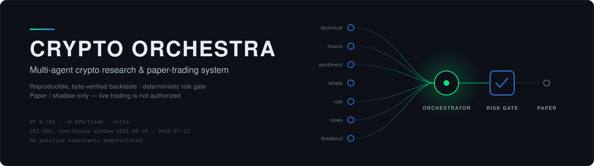
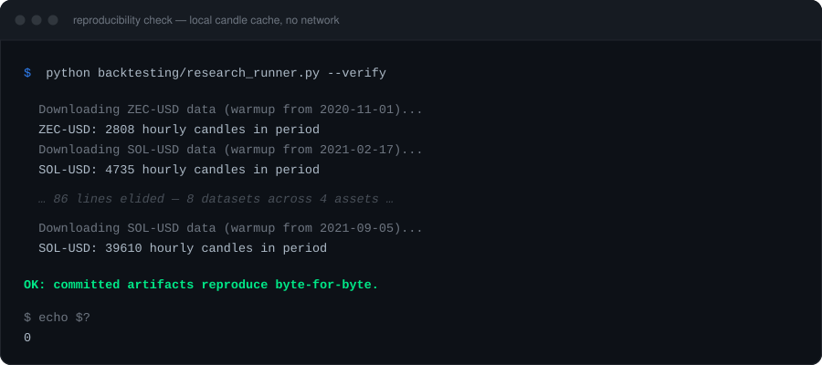

<p align="center">
  
</p>

<p align="center">
  <a href="https://github.com/Vito-bc/crypto-orchestra/actions/workflows/ci.yml"></a>
  <a href="https://www.python.org/downloads/release/python-3135/"></a>
  <a href="LICENSE"></a>
  <a href="docs/trial_registry.md"></a>
</p>

Seven specialist Claude sub-agents analyse an asset in parallel, an orchestrator
weighs their votes, and a deterministic risk engine decides whether the
resulting limit order is allowed. Every research number in this repository is a
byte-identical regeneration from a pinned environment — including the ones that
say the strategy does not work.

> [!WARNING]
> **Paper / shadow only — live trading is not authorized.** `DRY_RUN=true`;
> orders are simulated, not placed. **No positive expectancy has been
> demonstrated**: the frozen momentum mechanism runs at **PF 0.761
> (−0.62%/trade, n=114)** on the continuous ZEC window, and transfers worse to
> BTC, ETH and SOL. Details and the retraction history:
> **[docs/research/](docs/research/)** · **[docs/trial_registry.md](docs/trial_registry.md)**.

## Reproducibility

The claim this project actually stands on: the committed research artifacts
regenerate byte-for-byte, on a pinned interpreter and pinned result-determining
libraries, from a local candle cache.

<p align="center">
  
</p>

Both this and the cheaper `--verify-code` run in CI as required checks, fed by
credential-free public hydration. Code identity is content-addressed, input
identity is a window-scoped logical OHLCV hash, and the interpreter is pinned to
**3.13.5 exactly** — regenerating under anything else is refused rather than
silently producing different numbers. See
[docs/research/](docs/research/#reproducibility).

## What it does

```mermaid
flowchart LR
  subgraph A["7 sub-agents · claude-haiku-4-5 · parallel"]
    direction TB
    A1["technical — RSI, MACD, BB, EMA"]
    A2["macro — 4h regime, veto power"]
    A3["sentiment — Fear and Greed"]
    A4["whale — funding, BTC dominance"]
    A5["risk — ATR stop and target"]
    A6["news — asset headlines"]
    A7["breakout — price structure"]
  end

  S["signal scanner — momentum breakout"] --> A
  A --> O{{"orchestrator — claude-sonnet-4-6"}}
  O --> G["deterministic risk gate — 6 entry filters, circuit breakers"]
  G -->|allowed| L["limit order — simulated, DRY_RUN"]
  G -->|blocked| H["HOLD"]
```



Every 60 minutes the pipeline closes positions that hit stop / target /
max-hold, reconciles pending limit orders, runs the scanner, and — only if the
scanner produces a signal — spends tokens on the agents. The orchestrator's BUY
still has to clear the risk gate before an order is written.

## Safety model

The agents propose; deterministic code disposes. Every gate below is plain
Python, testable without an LLM, and **fails closed** — an unreadable input
blocks entry rather than waving it through.

| Entry filter | Rule |
|---|---|
| BTC regime + correlation | BTC 4h BEAR: corr ≥ 0.65 → full block · 0.35–0.65 → 50% size |
| Funding rate | OKX annualized funding > 20% → block (crowded longs) |
| Bounce confirmation | Price must recover +1.5x ATR above the last stop-exit |
| Velocity | Asset down > 5% in 24h → no long entry |
| Daily EMA | Per-asset trend veto (ZEC 200d, ETH 50d) |
| Whipsaw guard | 2+ stops in 96h → block re-entry |

| Drawdown from peak | Action |
|---|---|
| −5% | Position size → 50% |
| −8% | Position size → 25% |
| −12% | **All trading halted** — manual review required |
| Daily loss −2% | Position size → 50% |

Sizing is `LIVE_BALANCE_USD x position_size_pct`, defined once in
[`pipeline/sizing.py`](pipeline/sizing.py) and defaulting to **$100**. The
circuit breakers measure against the same baseline.

### Live trading

Not enabled, and this README deliberately does not document how to switch it on.
Activation would require, in order: a repaired evaluation harness, a
pre-registered strategy with an acceptance rule fixed in advance, a forward
shadow trial that passes it, and an explicit human decision recorded in
[docs/trial_registry.md](docs/trial_registry.md). **None of those conditions is
met.** `LIVE_BALANCE_USD=100` is the cap that *would* apply if live trading were
ever authorized — it is not evidence that money is at risk today.

## Quick start

Requires **Python 3.13.5** (exact — the research tooling refuses other
versions). No exchange credentials are needed for anything below.

```bash
python -m venv venv
venv\Scripts\activate                    # Windows
pip install -r requirements.txt
copy .env.example .env                   # fill in ANTHROPIC_API_KEY

python pipeline/runner.py ZEC-USD        # one paper run, one asset
python pipeline/scheduler.py             # continuous loop, every 60 min
streamlit run app.py -- --demo           # dashboard on the synthetic UI fixture
```

Research, offline and credential-free:

```bash
python backtesting/hydrate_research_data.py      # public Coinbase candles
python backtesting/research_runner.py --verify   # byte-identical regeneration
python -m pytest -q                              # hermetic: no network, no .env
```

> The `--demo` dashboard renders `demo/` — a hand-authored synthetic fixture for
> exercising the UI. It is **not** a backtest and **not** a track record. Real
> results are in [docs/research/](docs/research/).

## Repository layout

```
agents/          7 specialist sub-agents + orchestrator
pipeline/        runner (risk engine), limit orders, position tracker,
                 scheduler, sizing, dashboards, Telegram summaries
exchange/        all Coinbase calls, isolated for auditing
backtesting/     signal scanner, research runner, walk-forward, Monte Carlo
tools/           price data, support/resistance levels, market positioning
schemas/         Pydantic contracts shared by every agent
docs/research/   research index, artifacts, manifests
docs/            trial registry, ADRs, task briefs
tests/           914 tests — hermetic, network denied at the socket layer
```

## Configuration

| Variable | Required | Description |
|---|---|---|
| `ANTHROPIC_API_KEY` | Yes | Claude API key |
| `TELEGRAM_BOT_TOKEN` | No | Telegram alerts |
| `TELEGRAM_CHAT_ID` | No | Chat ID for alerts |
| `DRY_RUN` | No | `true` (default) = paper · `false` = real orders |
| `LIVE_BALANCE_USD` | No | Sizing baseline (default: 100) |
| `PIPELINE_INTERVAL_MINUTES` | No | Scheduler interval (default: 60) |
| `SUBAGENT_MODEL` | No | Default `claude-haiku-4-5` |
| `ORCHESTRATOR_MODEL` | No | Default `claude-sonnet-4-6` |

`LIVE_BALANCE_USD` is unrelated to `START_BALANCE` in `backtesting/` — that is a
simulation convention so historical replays report readable dollars, not a cap.

## Security

- `.env` and `cdp_api_key.json` (Coinbase ECDSA key) are git-ignored — never commit either.
- `DRY_RUN=true` is the default; no real order is placed without an explicit opt-in.
- Coinbase API keys must have `can_transfer=false`; preflight treats withdrawal rights as a blocking error.
- All exchange calls are isolated in `exchange/coinbase_client.py`.
- Vulnerability reports: [SECURITY.md](SECURITY.md).

## Contributing

See [CONTRIBUTING.md](CONTRIBUTING.md). The short version: research claims need a
pre-registered trial ID in [docs/trial_registry.md](docs/trial_registry.md)
before the scan, not after, and every PR must keep `lint`, `tests` and
`research-verify` green.

## License

[MIT](LICENSE).
